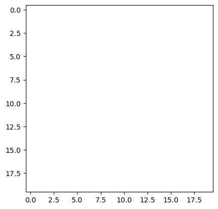
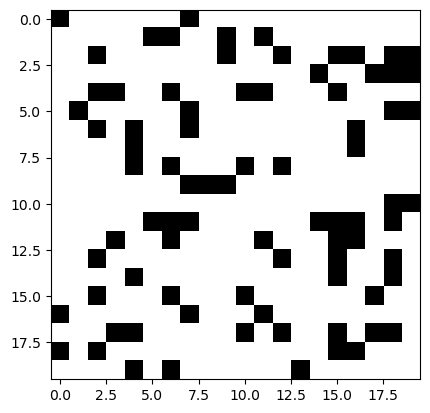
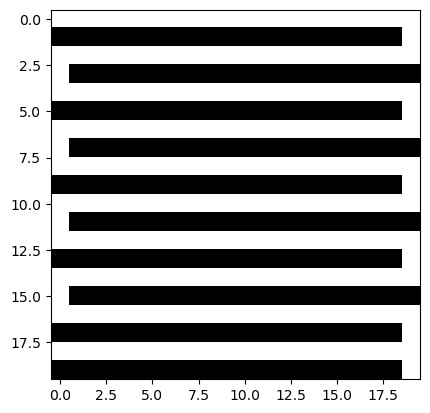
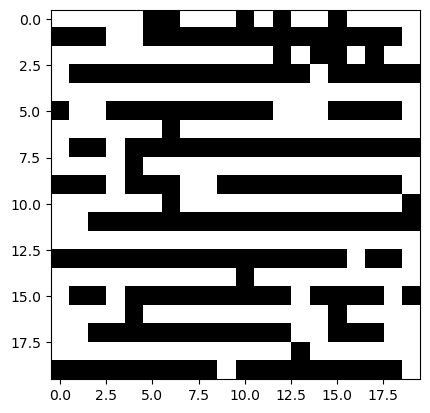
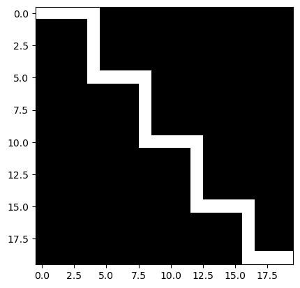
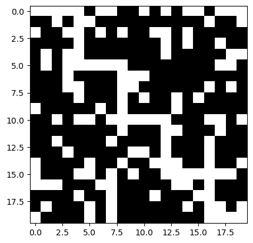
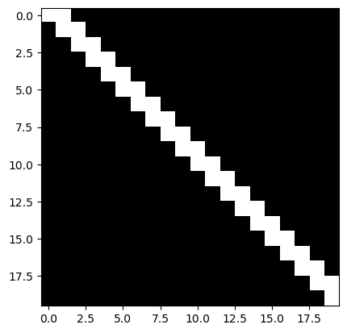
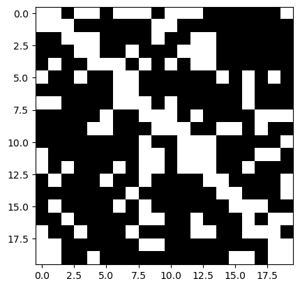

# Projekt do předmětu VVP - Hledání nejkratší cesty v bludišti
    Denisa Valová - VAL0575

soubor projekt.ipynb hledá a vypisuje nejkratší cestu zadaným bludištěm - výběr dat ve funkci nacti_data 

soubor projekt_generator.ipynb generuje podle šablon nová bludistě a ověřuje jejich správnost, ve funkci zmena_policek se určuje, kolik políček se má oproti šabloně náhodně změnit; 
zde příklady:

